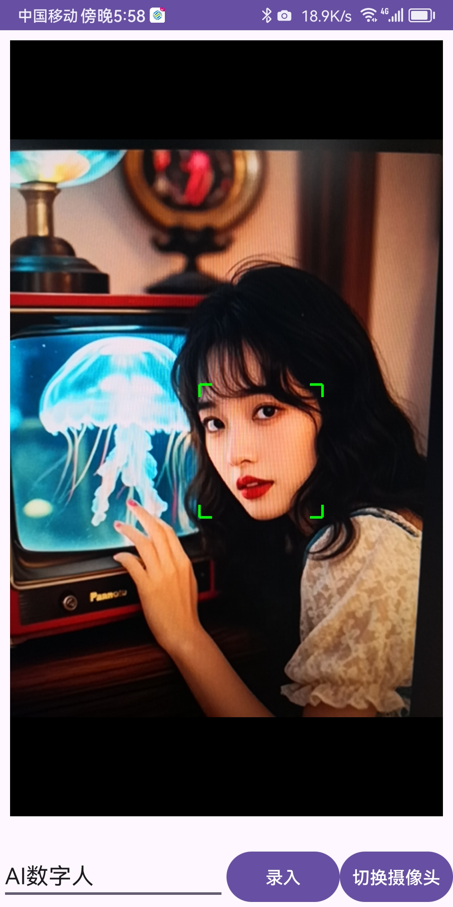

# 基于开源软件 inspireface 的人脸识别demo

参考
**本项目是基于开源项目 https://github.com/HyperInspire/inspireface-android-sdk 适配的UI界面**
**本项目是基于开源项目 https://github.com/HyperInspire/InspireFace**


## 项目目的
    为了研究人脸识别app，以及为了体验做出demo的成就感。
    之前版本没有UI太痛苦了

## 改进地方
1. 做了UI界面 ，适配横屏安卓工控机，也适配手机app
2. 为了优化APP体积，只保留InspireFace.PIKACHU 模型删除了 InspireFace.Megatron。觉得需要自己添加
3. 添加通过相册录入人脸，也可以批量读取文件夹内人脸
4. 选择照片人脸识别
5. 通过摄像头录入人脸信息
6. 通过摄像头实时识别人脸，并且在界面上框选人脸和显示名称
7. 自建本地数据存放人脸id对应名称
8. 可以查用户列表和删除用户特征值
9. 采用kotlin语言开发


## 页面预览

|  |  |
| --- | --- |
|  |  |


大家可以自己下载玩一玩，再release 里面有apk文件
觉得不错给我个star吧


哦，还有一个重要的事情，我之前在退出摄像头页面的时候释放代码就崩溃了，研究了半天
```kotlin
    InspireFace.ReleaseSession(session)
    InspireFace.FeatureHubDataDisable()
    InspireFace.GlobalTerminate()
```
因为我在ondestroy()里面调用了以上代码，把InspireFace释放了，但是最后一帧的bitmap还没处理完毕，一旦调用InspireFace里面的其他方法就会崩溃，大家谨记谨记，一定得处理完毕后才能释放资源。


对了，给我个star吧